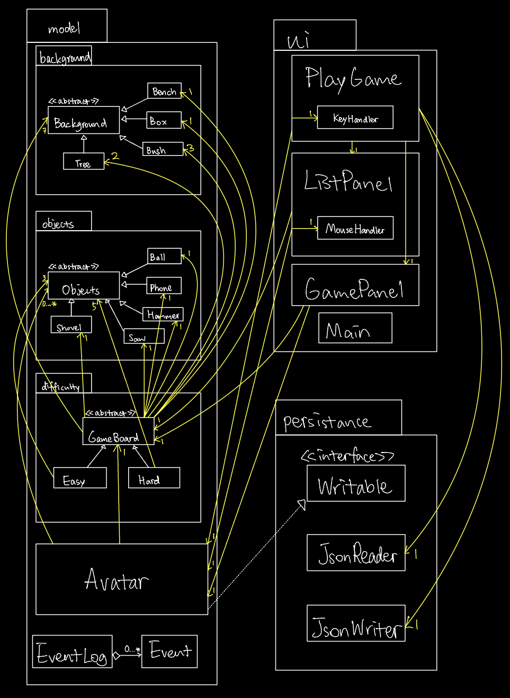

# Now You Find Me

## About
This is a game that you need to find the objects required.
The objects are hidden in the background of the scene,
there are trees, bushes, flowers, boxes, benches,
and you have to explore to find the object, 
or trigger some switches, 
or solve the puzzle to get the password of some boxes.

There are two difficulty levels of the game, 
which are **easy** and **hard**.
There are three objects you need to find in easy level and
five objects in hard. You can also use the object you found
as a tool to help you find other objects.

It is like a *puzzle game*,
so basically **everyone** can play this game.
There is a small character on the interface that players 
can move it around to find the objects, and it also has
some functionalities such as remove, push, shake tree.

It is an interesting project for me because 
I really enjoy playing puzzle game online, the game
sort of create a virtual world 
where you have to search for the clues by yourself 
like a detective to win the game.
It also needs a lot of creative, logical, and reasonable
ideas to build this game, so that the game is fun and solvable.
It is a good opportunity for me to improve my creativity
and logical reasoning skills.

## User Stories
- As a user, I want to start a game and choose the difficulty.
- As a user, I want to move my character in the scene.
- As a user, I want to find all the hidden objects.
- As a user, I want to remove the found object from hidden list and add it to found list.
- As a user, when I select the quit option from the application menu, 
I want to be reminded to save my found and hidden lists to file and have the option to do so or not.
- As a user, when I start the application, I want to be given the option to load my lists from file.

## Instructions for Grader
- You can generate the first required event related to displaying found objects on the list panel if you find an object,
and double click to see bigger image.
- You can generate the second required event related to showing the hidden objects by click on the button.
- You can locate my visual component when game started, the background images of the game will be drawn 
and also the objects on the panel.
- You can save the state of my application by a pop-up menu when quit.
- You can reload the state of my application by a pop-up menu before start.

### Phase 4: Task 2
Examples of EventLog:

-Game started:  
Wed Nov 30 22:24:32 PST 2022  
Game started with "Easy"

-Moved left:  
Wed Nov 30 22:24:36 PST 2022  
Avatar moved left

-Moved right:  
Wed Nov 30 22:24:39 PST 2022  
Avatar moved right

-Interacted but nothing found:  
Wed Nov 30 22:24:37 PST 2022  
Avatar interacted

-Interacted with something found:  
Wed Nov 30 22:24:42 PST 2022  
Avatar interacted

Wed Nov 30 22:24:42 PST 2022  
Hammer found.

### Phase 4: Task 3

UML class diagram reflection:  
There are a lot of improvements I can see from my diagram, first of all, there aren't many coupling present in the code, however there can be some improvements in Avatar class,
where it kind of shows a low cohesion. It can be farther separated into two classes which one class handles the model, one class handles ui. 
Moreover, some refactoring can be made in background, objects, and difficulty packages. There are many redundancies in the code, and instead of making classes extend one abstract class,
I could have just made them a field of String in the class. This can improve the readability of the code and also easier to trace when an alteration needs to be done.